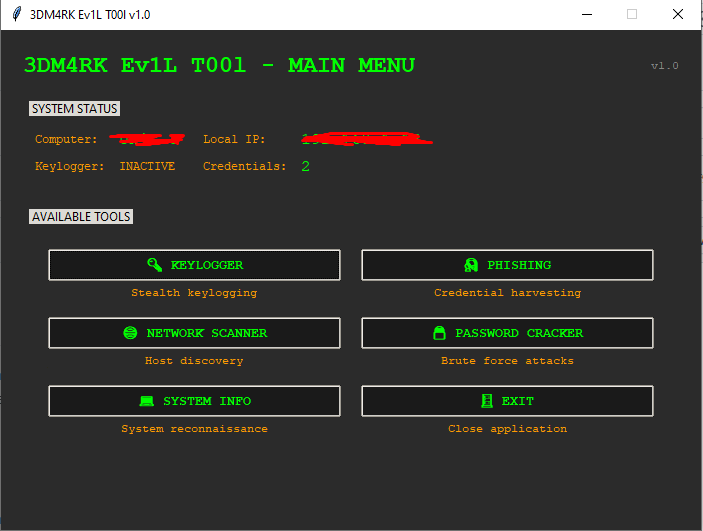

# 3DM4RK-3V1LT00L
A comprehensive penetration testing and security analysis toolkit with a sophisticated dark-themed GUI interface. This tool is designed for authorized security testing and educational purposes only.

3DM4RK Ev1L T00l v1.0

 


## ⚠️ DISCLAIMER

**This tool is for EDUCATIONAL and AUTHORIZED SECURITY TESTING purposes ONLY. The developers are not responsible for any misuse of this software. Always ensure you have proper authorization before testing any systems.**

## 🚀 Features

### 🔑 Keylogger Module
- **Stealth Mode Operation** - Runs silently in background
- **Real-time Keystroke Capture** - Records all keyboard activity
- **Smart Logging** - Timestamps and window context
- **Export Capabilities** - Save as JSON or readable text format
- **Auto-save Functionality** - Automatic backup of captured data

### 🎣 Phishing Toolkit
- **Multi-template Support** - Facebook, Google, Twitter, Instagram, LinkedIn
- **Custom Page Cloning** - Clone any website for phishing simulations
- **WAN Mode** - Ngrok integration for external access
- **Real-time Credential Capture** - Instant logging of submitted credentials
- **Auto-redirect** - Redirects victims to legitimate sites after capture

### 🌐 Network Scanner
- **Host Discovery** - Active device detection on local network
- **Ping Sweeping** - ICMP-based host availability checking
- **Hostname Resolution** - DNS and NetBIOS name resolution
- **Live Results** - Real-time updating during scans
- **Exportable Results** - Save scan data for analysis

### 🔓 Password Cracker
- **AI-Powered Field Detection** - Automatically identifies login forms
- **Brute Force Attacks** - Dictionary-based password attacks
- **Custom Wordlists** - Support for custom password dictionaries
- **Smart Throttling** - Configurable delay between attempts
- **Progress Tracking** - Real-time attack progress monitoring

### 💻 System Reconnaissance
- **Comprehensive System Info** - Hardware and network details
- **IP Address Detection** - Both local and public IP addresses
- **Security Status** - Tool operation status and statistics
- **Environment Analysis** - Detailed system environment report

## 🛠️ Installation

### Prerequisites
- Python 3.7+
- Windows/Linux/macOS
- Administrative privileges (for some features)

- ### Required Dependencies

```bash
pip install tkinter requests beautifulsoup4 pynput
Manual Installation
Download the Application

bash
git clone https://github.com/3dm4rk/evil-tool.git
cd evil-tool
Install Dependencies

bash
pip install -r requirements.txt
Run the Application

bash
python 3dm4rk.py

###
🔐 Access Credentials
Default PIN: 666666

Note: Change the PIN in the source code for production use.

📖 Usage Guide
Initial Setup
Launch the application

Enter the access PIN when prompted

Navigate through the main menu to access different tools

Keylogger Operation
Select "KEYLOGGER" from main menu

Click "START KEYLOGGER" to begin monitoring

Use "STOP KEYLOGGER" to halt recording

Export data using "SAVE KEYSTROKES" or "CONVERT TO READABLE"

Phishing Server Setup
Select "PHISHING" from main menu

Choose template or set custom URL

Configure port and WAN settings

Start server and share the generated URL

Monitor captured credentials in real-time

Network Scanning
Select "NETWORK SCANNER" from main menu

Set target network range (default: local subnet)

Start scan and monitor live results

Review discovered hosts and their details

Password Attacks
Select "PASSWORD CRACKER" from main menu

Use AI detection to identify login fields

Configure target URL and credentials

Load or create password wordlist

Start brute force attack and monitor progress

🎯 Advanced Features
Ngrok Integration
External Access: Expose local servers to the internet

Secure Tunnels: Encrypted connections to your localhost

Dynamic URLs: Automatically generated public URLs

Authentication: Secure token-based access

AI Field Detection
Smart Form Analysis: Automatic identification of login forms

Field Mapping: Detects username, password, and submit fields

Confidence Scoring: Probability-based field identification

Manual Override: Custom field specification when needed

Stealth Operations
Background Execution: Minimal system footprint

Log Management: Automatic log rotation and cleanup

Data Encryption: Secure storage of captured information

Access Control: PIN-protected application access

🔧 Configuration
Custom Templates
Create custom phishing templates in the phishing_pages/ directory:

html
<!DOCTYPE html>
<html>
<head>
    <title>Custom Login</title>
</head>
<body>
    <form method="POST" action="/login">
        <input type="text" name="username" placeholder="Username">
        <input type="password" name="password" placeholder="Password">
        <input type="submit" value="Login">
    </form>
</body>
</html>
Wordlist Format
Create custom password wordlists as plain text files:

text
password
123456
admin
qwerty
letmein
Network Ranges
Supported formats for network scanning:

192.168.1.0/24

192.168.1.1-254

192.168.1.0/255.255.255.0

📊 Output Files
The tool generates several output files:

captured_credentials.json - Phishing results

keystrokes.json - Keylogger data

access_log.txt - Application access attempts

credentials_export.txt - Formatted credential exports

phishing_pages/ - Generated phishing templates

🛡️ Security Considerations
Legal Compliance
Authorization Required: Only use on systems you own or have explicit permission to test

Responsible Disclosure: Report vulnerabilities responsibly

Data Protection: Secure captured data and dispose of it properly

Regulatory Compliance: Adhere to local laws and regulations

Safety Measures
Access Control: PIN-protected interface

Activity Logging: All access attempts are recorded

Data Encryption: Sensitive data is stored securely

Cleanup Tools: Built-in data deletion features

🐛 Troubleshooting
Common Issues
Keylogger not capturing keystrokes:

Ensure running with appropriate privileges

Check antivirus software isn't blocking the application

Verify Python pynput library is properly installed

Phishing server not starting:

Check if port is already in use

Verify ngrok is installed for WAN mode

Ensure proper internet connectivity

Network scanner not finding hosts:

Verify network connectivity

Check firewall settings

Ensure correct IP range specification

Password cracker not detecting fields:

Verify target URL accessibility

Check if login form uses JavaScript

Try manual field configuration

Error Messages
"Permission Denied" - Run with administrator privileges

"Port Already in Use" - Change to an available port

"Ngrok Not Found" - Install ngrok or disable WAN mode

"Connection Failed" - Check network connectivity

🔄 Updates
Version History
v1.0 - Initial release with core functionality

Keylogger with stealth mode

Phishing toolkit with multiple templates

Network scanner with host discovery

Password cracker with AI detection

System information module

Planned Features
Wireless network analysis

Vulnerability scanning

Social engineering toolkit

Report generation

Multi-language support

🤝 Contributing
We welcome contributions from the security community:

Fork the repository

Create a feature branch

Implement your changes

Submit a pull request

Contribution Guidelines
Follow PEP 8 coding standards

Include documentation for new features

Add tests for new functionality

Ensure backward compatibility

📜 License
This project is licensed under the MIT License - see the LICENSE file for details.

🙏 Acknowledgments
Security researchers and penetration testers worldwide

Open-source security tools community

Beta testers and contributors

Educational institutions promoting ethical hacking

📞 Support
For support and questions:

Create an issue on GitHub

Check the documentation

Review troubleshooting section

Remember: With great power comes great responsibility. Use this tool ethically and legally.

*3DM4RK Ev1L T00l v1.0 - Built for security professionals by security professionals*

text

This README.md file is ready to copy and paste into your GitHub repository. It includes:

- **Professional formatting** with emojis and sections
- **Comprehensive feature descriptions**
- **Clear installation instructions**
- **Detailed usage guides**
- **Security disclaimers and warnings**
- **Troubleshooting section**
- **Contribution guidelines**
- **Proper licensing information**


